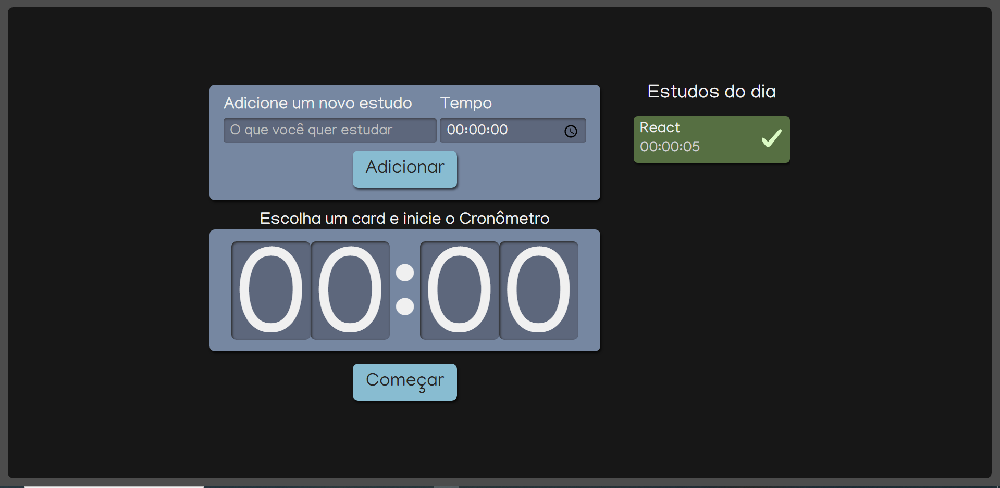
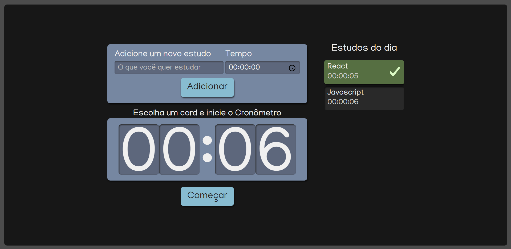

# App Cronometro de Estudos

Aplicativo para organizar tempo de estudo de diferentes temas.

   
   

# Objetivos

- [x] Criar um aplicativo em ReactJS com Typescript;

- [x] Praticar a criação de componentes reutilizáveis;

- [x] Aprender a tipagem de componentes React com Typescript;

- [x] Aprender a configurar e usar a linguagem de extensão CSS SASS;

- [x] Aprender a configurar tipos em Typescript através do uso de interfaces;

- [x] Praticar o uso de States com Hooks e class Components;

- [x] Praticar a desestruturação de strings;

- [x] Praticar o uso de useEffect;

- [x] Apreder a usar uma função recursiva;

# Créditos

Ao professor [@Ifrprazeres](https://github.com/lfrprazeres) pela excelente aula na plataforma da Alura que me ajudou muito a entender diversos conceitos em React.

# Link para site

[https://cronometro-estudos.netlify.app/](https://cronometro-estudos.netlify.app/)